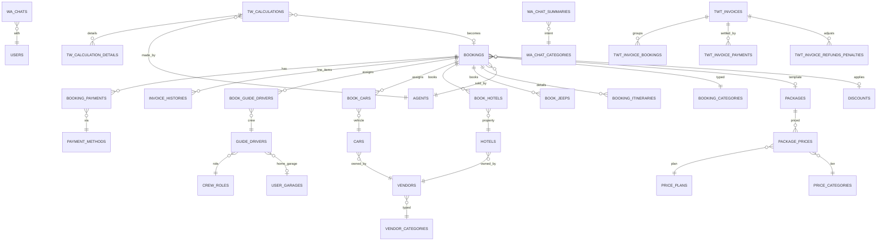

# Backoffice MySQL — Schema Map

Snapshot 2026-05-25. MariaDB 10.11, database `u1805424_jvto_clone`.

- **Total tables:** 210
- **Total foreign keys:** 270
- Full DDL: `raw/backoffice/schema/full-schema.sql`
- Live Laravel models: `f:/BACK OFFICE/new-backoffice/app/Models/` (179 model files)

## Core entity ERD (Mermaid)

Subset of business-critical entities. Full schema in DDL file.

## Foreign-key web (per-table)

Tables with declared FKs — useful for impact analysis.

| Table | FK column → ref table.column |
|---|---|
| `accommodations` | `category_id` → `accommodation_categories.id` |
| `activities` | `hotel_id` → `hotels.id` |
| `activities` | `destination_id` → `destinations.id` |
| `activities` | `activity_category_id` → `activity_categories.id` |
| `activity_destination_medias` | `activity_destination_id` → `activity_destinations.id` |
| `activity_destinations` | `destination_id` → `destinations.id` |
| `activity_destinations` | `activity_category_id` → `activity_categories.id` |
| `activity_destinations` | `to_destination_id` → `destinations.id` |
| `activity_destinations` | `from_destination_id` → `destinations.id` |
| `activity_starts` | `destination_id` → `destinations.id` |
| `add_on_carts` | `cart_id` → `carts.id` |
| `add_on_carts` | `add_on_id` → `add_ons.id` |
| `add_on_packages` | `package_id` → `packages.id` |
| `add_on_packages` | `add_on_id` → `add_ons.id` |
| `article_media` | `article_id` → `articles.id` |
| `book_activities` | `booking_id` → `bookings.id` |
| `book_add_ons` | `booking_id` → `bookings.id` |
| `book_add_ons` | `add_on_package_id` → `add_on_packages.id` |
| `book_add_ons` | `add_on_id` → `add_ons.id` |
| `book_attachments` | `booking_id` → `book_attachments.id` |
| `book_car_activities` | `debt_payment_id` → `debt_payments.id` |
| `book_car_activities` | `car_id` → `cars.id` |
| `book_car_activities` | `booking_id` → `bookings.id` |
| `book_cars` | `car_id` → `cars.id` |
| `book_cars` | `booking_id` → `bookings.id` |
| `book_crew_activities` | `booking_id` → `bookings.id` |
| `book_crew_activities` | `debt_payment_id` → `debt_payments.id` |
| `book_crew_activities` | `crew_role_id` → `crew_roles.id` |
| `book_destination_activities` | `booking_id` → `bookings.id` |
| `book_destination_activities` | `destination_id` → `destinations.id` |
| `book_destination_activities` | `destination_activity_id` → `destination_activities.id` |
| `book_destination_activities` | `debt_payment_id` → `debt_payments.id` |
| `book_guide_drivers` | `guide_id` → `guide_drivers.id` |
| `book_guide_drivers` | `booking_id` → `bookings.id` |
| `book_hotel_meals` | `hotel_id` → `hotels.id` |
| `book_hotel_meals` | `booking_id` → `bookings.id` |
| `book_hotel_meals` | `book_hotel_id` → `book_hotels.id` |
| `book_hotel_service` | `hotel_service_id` → `hotel_services.id` |
| `book_hotel_service` | `book_room_hotel_id` → `book_room_hotels.id` |
| `book_hotels` | `hotel_id` → `hotels.id` |
| `book_hotels` | `debt_payment_id` → `debt_payments.id` |
| `book_hotels` | `booking_itinerary_id` → `booking_itineraries.id` |
| `book_hotels` | `booking_id` → `bookings.id` |
| `book_itineraries` | `booking_id` → `bookings.id` |
| `book_itinerary_details` | `destination_id` → `destinations.id` |
| `book_itinerary_details` | `book_itinerary_id` → `book_itineraries.id` |
| `book_itinerary_details` | `area_id` → `areas.id` |
| `book_jeeps` | `hotel_id` → `hotels.id` |
| `book_jeeps` | `booking_id` → `bookings.id` |
| `book_meals` | `booking_id` → `bookings.id` |
| `book_others_activities` | `others_activity_id` → `others_activities.id` |
| `book_others_activities` | `debt_payment_id` → `debt_payments.id` |
| `book_others_activities` | `booking_id` → `bookings.id` |
| `book_room_hotels` | `booking_itinerary_id` → `booking_itineraries.id` |
| `book_room_hotels` | `booking_id` → `bookings.id` |
| `book_room_hotels` | `book_hotel_id` → `book_hotels.id` |
| `book_room_hotels` | `room_hotel_id` → `room_hotels.id` |
| `book_services` | `service_id` → `services.id` |
| `book_services` | `guide_ijen_id` → `guide_drivers.id` |
| `book_services` | `booking_id` → `bookings.id` |
| `booking_additional_price_bookings` | `booking_id` → `bookings.id` |
| `booking_categories` | `agent_id` → `agents.id` |
| `booking_details` | `price_plan_id` → `price_plans.id` |
| `booking_details` | `package_id` → `packages.id` |
| `booking_details` | `booking_id` → `bookings.id` |
| `booking_documents` | `user_id` → `users.id` |
| `booking_documents` | `booking_id` → `bookings.id` |
| `booking_documents` | `attachment_type_id` → `attachment_types.id` |
| `booking_itineraries` | `activity_start_id` → `activity_starts.id` |
| `booking_itineraries` | `activity_end_id` → `activity_ends.id` |
| `booking_payments` | `payment_method_id` → `payment_methods.id` |
| `booking_payments` | `booking_id` → `bookings.id` |
| `booking_refund_and_penalties` | `booking_id` → `bookings.id` |
| `booking_reviews` | `booking_id` → `bookings.id` |
| `bookings` | `is_vendor_paid_payment_method_id` → `payment_methods.id` |
| `bookings` | `agent_id` → `agents.id` |
| `bookings` | `hotel_id_transport` → `hotels.id` |
| `bookings` | `user_id` → `users.id` |
| `bookings` | `discount_id` → `discounts.id` |
| `bookings` | `template_package_id` → `packages.id` |
| `bookings` | `bromo_hotel_id` → `hotels.id` |
| `bookings` | `note_category_id` → `note_categories.id` |
| `bookings` | `booking_category_id` → `booking_categories.id` |
| `calculation_detail_others` | `item_id` → `item_calculation_others.id` |
| `calculation_detail_others` | `calculation_id` → `calculations.id` |
| `calculation_details` | `item_id` → `item_calculations.id` |
| `calculation_details` | `calculation_id` → `calculations.id` |
| `calculations` | `booking_id` → `bookings.id` |
| `car_activities` | `car_id` → `cars.id` |
| `car_configurations` | `car_id` → `cars.id` |
| `car_configurations` | `crew_twt_role_id` → `crew_roles.id` |
| `car_configurations` | `crew_klook_role_id` → `crew_roles.id` |
| `car_configurations` | `crew_jvto_role_id` → `crew_roles.id` |
| `cars` | `vendor_id` → `vendors.id` |
| `cars` | `garage_id` → `garages.id` |
| `carts` | `user_id` → `users.id` |
| `carts` | `package_price_id` → `package_prices.id` |
| `carts` | `package_id` → `packages.id` |
| `component_contents` | `component_id` → `components.id` |
| `crew_reviews` | `crew_id` → `guide_drivers.id` |
| `crew_reviews` | `booking_review_id` → `booking_reviews.id` |
| `crew_reviews` | `booking_id` → `bookings.id` |
| `crew_roles` | `vendor_id` → `vendors.id` |
| `crew_roles` | `order_channel_id` → `order_channels.id` |
| `debt_payment_details` | `payment_id` → `debt_payments.id` |
| `debt_payment_details` | `booking_id` → `bookings.id` |
| `debt_payments` | `vendor_id` → `vendors.id` |
| `debt_payments` | `payment_method_id` → `payment_methods.id` |
| `destination_activities` | `activity_id` → `activities.id` |
| `destination_activities` | `vendor_id` → `vendors.id` |
| `destination_activities` | `destination_id` → `destinations.id` |
| `destination_details` | `destination_id` → `destinations.id` |
| `destinations` | `gallery_id` → `galleries.id` |
| `destinations` | `activity_id` → `activities.id` |
| `discounts` | `user_id` → `users.id` |
| `discounts` | `gift_card_id` → `gift_cards.id` |
| `discounts` | `booking_id` → `bookings.id` |
| `email_accounts` | `provider_id` → `email_providers.id` |
| `event_sequences` | `activity_destination_id` → `activity_destinations.id` |
| `event_sequences` | `itinerary_id` → `itineraries.id` |
| `expense_additionals` | `submit_by` → `guide_drivers.id` |
| `expense_additionals` | `booking_id` → `bookings.id` |
| `expense_additionals` | `approved_by` → `users.id` |
| `expense_refunds` | `booking_id` → `bookings.id` |
| `expense_revisions` | `booking_id` → `bookings.id` |
| `extra_luggages` | `price_maker_id` → `price_makers.id` |
| `faq_subcategories` | `faq_category_id` → `faq_categories.id` |
| `faqs` | `faq_subcategory_id` → `faq_subcategories.id` |
| `faqs` | `faq_category_id` → `faq_categories.id` |
| `fcm_tokens` | `user_id` → `accounts.id` |
| `file_tags` | `file_id` → `files.id` |
| `file_tags` | `tag_id` → `tags.id` |
| `files` | `folder_id` → `folders.id` |
| `files` | `file_type_id` → `file_types.id` |
| `folders` | `parent_id` → `folders.id` |
| `folders` | `folder_type_id` → `folder_types.id` |
| `galleries` | `destination_id` → `destinations.id` |
| `guide_drivers` | `garage_id` → `garages.id` |
| `hotel_images` | `hotel_id` → `hotels.id` |
| `hotel_services` | `hotel_id` → `hotels.id` |
| `hotels` | `vendor_id` → `vendors.id` |
| `hotels` | `destination_id` → `destinations.id` |
| `hotels` | `area_id` → `areas.id` |
| `hotels` | `area2_id` → `areas.id` |
| `identity_cards` | `identity_type_id` → `identities_types.id` |
| `identity_cards` | `guide_driver_id` → `guide_drivers.id` |
| `image_panoramas` | `destination_id` → `destinations.id` |
| `invoice_histories` | `booking_id` → `bookings.id` |
| `invoice_twt_details` | `invoice_twt_id` → `invoice_twts.id` |
| `invoice_twt_details` | `booking_id` → `bookings.id` |
| `item_activities` | `category_id` → `item_activity_categories.category_id` |
| `item_calculations` | `destination_id` → `destinations.id` |
| `itineraries` | `package_id` → `packages.id` |
| `itineraries` | `activity_start_id` → `activity_starts.id` |
| `itineraries` | `activity_end_id` → `activity_ends.id` |
| `itinerary_destinations` | `second_activity_id` → `activities.id` |
| `itinerary_destinations` | `package_id` → `packages.id` |
| `itinerary_destinations` | `itinerary_id` → `itineraries.id` |
| `itinerary_destinations` | `destination_id` → `destinations.id` |
| `itinerary_destinations` | `second_destination_id` → `destinations.id` |
| `itinerary_destinations` | `activity_id` → `activities.id` |
| `itinerary_details` | `activity_id` → `activities.id` |
| `itinerary_details` | `location_id` → `locations.id` |
| `itinerary_details` | `itinerary_id` → `itineraries.id` |
| `itinerary_invoices` | `booking_id` → `bookings.id` |
| `itinerary_meals` | `itinerary_id` → `itineraries.id` |
| `itinerary_meals` | `price_plan_id` → `price_plans.id` |
| `itinerary_route_destinations` | `itinerary_route_id` → `itinerary_routes.id` |
| `itinerary_route_destinations` | `destination_id` → `destinations.id` |
| `itinerary_route_details` | `itinerary_route_id` → `itinerary_routes.id` |
| `itinerary_route_details` | `destination_id` → `destinations.id` |
| `itinerary_route_details` | `activity_category_id` → `activity_categories.id` |
| `itinerary_routes` | `start_destination_id` → `destinations.id` |
| `itinerary_routes` | `end_destination_id` → `destinations.id` |
| `jvto_review_crews` | `jvto_review_id` → `jvto_reviews.id` |
| `jvto_review_crews` | `crew_id` → `guide_drivers.id` |
| `others_activities` | `vendor_id` → `vendors.id` |
| `package_activities` | `package_id` → `packages.id` |
| `package_activity_faqs` | `package_activity_id` → `package_activities.id` |
| `package_activity_packages` | `package_activity_id` → `package_activities.id` |
| `package_activity_packages` | `package_id` → `packages.id` |
| `package_banners` | `package_id` → `packages.id` |
| `package_banners` | `gallery_id` → `galleries.id` |
| `package_destinations` | `package_id` → `packages.id` |
| `package_destinations` | `destination_id` → `destinations.id` |
| `package_hotels` | `price_plan_id` → `price_plans.id` |
| `package_hotels` | `package_id` → `packages.id` |
| `package_hotels` | `hotel_id` → `hotels.id` |
| `package_include_excludes` | `package_id` → `packages.id` |
| `package_include_excludes` | `include_exclude_id` → `include_excludes.id` |
| `package_meals` | `price_plan_id` → `price_plans.id` |
| `package_meals` | `package_id` → `packages.id` |
| `package_prices` | `price_plan_id` → `price_plans.id` |
| `package_prices` | `price_category_id` → `price_categories.id` |
| `package_prices` | `package_id` → `packages.id` |
| `package_transportations` | `transportation_id` → `cars.id` |
| `package_transportations` | `price_plan_id` → `price_plans.id` |
| `packages` | `start_destination_id` → `destinations.id` |
| `packages` | `duration_id` → `durations.id` |
| `packages` | `package_category_id` → `package_categories.id` |
| `packages` | `category_id` → `categories.id` |
| `packages` | `package_activity_id` → `package_activities.id` |
| `packages` | `experience_id` → `experiences.id` |
| `packages` | `end_destination_id` → `destinations.id` |
| `participants` | `booking_id` → `bookings.id` |
| `partner_discount_codes` | `partner_discount_id` → `partner_discounts.id` |
| `partner_discount_codes` | `discount_id` → `discounts.id` |
| `police_escorts` | `booking_id` → `bookings.id` |
| `price_maker_location_details` | `price_maker_location_id` → `price_maker_locations.id` |
| `price_maker_location_details` | `price_maker_id` → `price_makers.id` |
| `price_maker_location_details` | `pos_transfer_id` → `pos_transfers.id` |
| `price_maker_locations` | `price_maker_id` → `price_makers.id` |
| `price_maker_price_paxs` | `price_maker_id` → `price_makers.id` |
| `price_makers` | `duration_id` → `durations.id` |
| `price_makers` | `category_id` → `categories.id` |
| `review_guides` | `guide_id` → `guide_drivers.id` |
| `review_guides` | `booking_id` → `bookings.id` |
| `reviews` | `package_id` → `packages.id` |
| `reviews` | `booking_id` → `bookings.id` |
| `reviews` | `user_id` → `users.id` |
| `room_configurations` | `room_hotel_id` → `room_hotels.id` |
| `room_configurations` | `package_id` → `packages.id` |
| `room_configurations` | `hotel_id` → `hotels.id` |
| `room_hotel_configurations` | `room_id` → `room_hotels.id` |
| `room_hotel_configurations` | `hotel_id` → `hotels.id` |
| `room_hotels` | `hotel_id` → `hotels.id` |
| `room_photos` | `room_hotel_id` → `room_hotels.id` |
| `room_photos` | `hotel_id` → `hotels.id` |
| `room_types` | `accommodation_id` → `accommodations.accommodation_id` |
| `services` | `area_id` → `areas.id` |
| `task_lists` | `task_id` → `tasks.id` |
| `trip_expense_items` | `trip_expense_location_id` → `trip_expense_locations.id` |
| `trip_expense_items` | `price_maker_location_detail_id` → `price_maker_location_details.id` |
| `trip_expense_locations` | `trip_expense_id` → `trip_expenses.id` |
| `trip_expense_locations` | `price_maker_location_id` → `price_maker_locations.id` |
| `trip_expenses` | `price_maker_id` → `price_makers.id` |
| `trip_expenses` | `booking_id` → `bookings.id` |
| `tw_calculation_details` | `tw_calculation_id` → `tw_calculations.id` |
| `tw_calculation_details` | `tw_calculation_category_id` → `tw_calculation_categories.id` |
| `tw_calculation_details` | `tw_calculation_item_id` → `tw_calculation_items.id` |
| `tw_calculation_details` | `tw_calculation_item_detail_id` → `tw_calculation_item_details.id` |
| `tw_calculation_item_details` | `category_code` → `tw_calculation_category_codes.id` |
| `tw_calculation_item_details` | `tw_calculation_item_id` → `tw_calculation_items.id` |
| `tw_calculation_item_details` | `pos_transfer_id` → `pos_transfers.id` |
| `tw_calculation_items` | `tw_calculation_category_id` → `tw_calculation_categories.id` |
| `tw_calculations` | `booking_id` → `bookings.id` |
| `twt_invoice_additionals` | `expense_additional_id` → `expense_additionals.id` |
| `twt_invoice_additionals` | `invoice_id` → `twt_invoices.id` |
| `twt_invoice_bookings` | `invoice_id` → `twt_invoices.id` |
| `twt_invoice_bookings` | `booking_id` → `bookings.id` |
| `twt_invoice_payments` | `invoice_id` → `twt_invoices.id` |
| `twt_invoice_refunds_penalties` | `invoice_id` → `twt_invoices.id` |
| `twt_invoice_refunds_penalties` | `expense_refund_id` → `expense_refunds.id` |
| `twt_invoices` | `agent_id` → `agents.id` |
| `user_accommodations` | `hotel_id` → `hotels.id` |
| `user_logs` | `user_id` → `users.id` |
| `user_logs` | `booking_id` → `bookings.id` |
| `users` | `country_id` → `countries.id` |
| `vendors` | `vendor_category_id` → `vendor_categories.id` |
| `wa_chat_summaries` | `user_id` → `users.id` |
| `wa_chat_summaries` | `category_id` → `wa_chat_categories.id` |
| `wa_chats` | `user_id` → `users.id` |
| `wa_drafts` | `trigger_message_id` → `wa_messages.id` |
| `wa_drafts` | `conversation_id` → `wa_conversations.id` |
| `wa_itineraries` | `user_id` → `users.id` |
| `wa_itineraries` | `booking_id` → `bookings.id` |
| `wa_logs` | `booking_id` → `bookings.id` |
| `wa_logs` | `user_id` → `users.id` |
| `wa_messages` | `conversation_id` → `wa_conversations.id` |
| `website_links` | `link_category_id` → `website_link_categories.id` |

## Full table inventory (all 210 tables)

| Table | Rows | Size KB | Bucket | Domain | FKs out |
|---|---:|---:|---|---|---:|
| `accommodation_categories` | 4 | 16 | business | hotels | 0 |
| `accommodations` | 0 | 16 | business | hotels | 1 |
| `accounts` | 3 | 16 | business | finance | 0 |
| `activities` | 18 | 16 | business | misc | 3 |
| `activity_categories` | 7 | 16 | business | products | 0 |
| `activity_destination_medias` | 0 | 16 | business | products | 1 |
| `activity_destinations` | 0 | 16 | business | products | 4 |
| `activity_ends` | 14 | 16 | business | products | 0 |
| `activity_starts` | 19 | 16 | business | products | 1 |
| `add_on_carts` | 0 | 16 | business | vehicles | 2 |
| `add_on_packages` | 365 | 48 | business | products | 2 |
| `add_ons` | 160 | 16 | business | misc | 0 |
| `agents` | 7 | 16 | business | people | 0 |
| `announcements` | 0 | 16 | business | misc | 0 |
| `areas` | 12 | 16 | business | misc | 0 |
| `article_media` | 0 | 16 | business | media | 1 |
| `articles` | 3 | 1536 | business | misc | 0 |
| `attachment_types` | 7 | 16 | business | media | 0 |
| `availabilities` | 2,400 | 480 | business | misc | 0 |
| `blogs` | 0 | 16 | business | misc | 0 |
| `book_activities` | 48 | 16 | sensitive | bookings | 1 |
| `book_add_ons` | 135 | 16 | sensitive | bookings | 3 |
| `book_attachments` | 0 | 16 | sensitive | bookings | 1 |
| `book_car_activities` | 564 | 64 | sensitive | bookings | 3 |
| `book_cars` | 1,065 | 96 | sensitive | bookings | 2 |
| `book_crew_activities` | 509 | 64 | sensitive | bookings | 3 |
| `book_destination_activities` | 4,294 | 368 | sensitive | bookings | 4 |
| `book_guide_drivers` | 2,105 | 160 | sensitive | bookings | 2 |
| `book_hotel_meals` | 643 | 80 | sensitive | bookings | 3 |
| `book_hotel_service` | 0 | 16 | sensitive | bookings | 2 |
| `book_hotels` | 2,487 | 192 | sensitive | bookings | 4 |
| `book_itineraries` | 249 | 48 | sensitive | bookings | 1 |
| `book_itinerary_details` | 0 | 16 | sensitive | bookings | 3 |
| `book_jeeps` | 98 | 16 | sensitive | bookings | 2 |
| `book_meals` | 48 | 16 | sensitive | bookings | 1 |
| `book_others_activities` | 2,577 | 208 | sensitive | bookings | 3 |
| `book_room_hotels` | 3,150 | 256 | sensitive | bookings | 4 |
| `book_services` | 146 | 16 | sensitive | bookings | 3 |
| `booking_additional_price_bookings` | 4 | 16 | sensitive | bookings | 1 |
| `booking_categories` | 3 | 16 | sensitive | bookings | 1 |
| `booking_details` | 1,451 | 208 | sensitive | bookings | 3 |
| `booking_documents` | 530 | 64 | sensitive | bookings | 3 |
| `booking_itineraries` | 3,595 | 1552 | sensitive | bookings | 2 |
| `booking_payments` | 506 | 80 | sensitive | finance | 2 |
| `booking_refund_and_penalties` | 3 | 16 | sensitive | bookings | 1 |
| `booking_reviews` | 0 | 16 | sensitive | bookings | 1 |
| `bookings` | 1,453 | 1552 | sensitive | bookings | 9 |
| `cache` | 4 | 16 | framework | misc | 0 |
| `cache_locks` | 0 | 16 | framework | misc | 0 |
| `calculation_detail_others` | 80 | 16 | business | misc | 2 |
| `calculation_details` | 169 | 16 | business | misc | 2 |
| `calculations` | 27 | 16 | business | misc | 1 |
| `car_activities` | 0 | 16 | business | vehicles | 1 |
| `car_configurations` | 24 | 16 | business | vehicles | 4 |
| `cars` | 27 | 16 | business | vehicles | 2 |
| `carts` | 4 | 16 | business | vehicles | 3 |
| `categories` | 4 | 16 | business | misc | 0 |
| `component_contents` | 0 | 16 | business | misc | 1 |
| `components` | 0 | 16 | business | misc | 0 |
| `countries` | 244 | 16 | business | misc | 0 |
| `crew_reviews` | 0 | 16 | business | people | 3 |
| `crew_roles` | 14 | 16 | business | people | 2 |
| `currency_exchange` | 0 | 16 | business | misc | 0 |
| `debt_payment_details` | 0 | 16 | sensitive | finance | 2 |
| `debt_payments` | 0 | 16 | sensitive | finance | 2 |
| `destination_activities` | 53 | 16 | business | products | 3 |
| `destination_details` | 6 | 16 | business | products | 1 |
| `destinations` | 38 | 16 | business | products | 2 |
| `discounts` | 623 | 80 | business | misc | 3 |
| `document_finders` | 20 | 16 | business | media | 0 |
| `durations` | 9 | 16 | business | misc | 0 |
| `email_accounts` | 0 | 16 | business | finance | 1 |
| `email_providers` | 0 | 16 | business | misc | 0 |
| `event_sequences` | 0 | 16 | business | misc | 2 |
| `expense_additionals` | 55 | 16 | business | finance | 3 |
| `expense_refunds` | 70 | 16 | business | finance | 1 |
| `expense_revisions` | 20 | 16 | business | finance | 1 |
| `experiences` | 0 | 16 | business | misc | 0 |
| `extra_luggages` | 9 | 16 | business | misc | 1 |
| `failed_jobs` | 0 | 16 | framework | misc | 0 |
| `faq_categories` | 12 | 16 | business | misc | 0 |
| `faq_subcategories` | 28 | 16 | business | misc | 1 |
| `faqs` | 63 | 16 | business | misc | 2 |
| `fcm_tokens` | 3 | 16 | business | misc | 1 |
| `file_tags` | 0 | 16 | business | media | 2 |
| `file_types` | 8 | 16 | business | media | 0 |
| `files` | 223 | 80 | business | media | 2 |
| `flipbooks` | 5 | 16 | business | bookings | 0 |
| `folder_types` | 12 | 16 | business | misc | 0 |
| `folders` | 105 | 16 | business | misc | 2 |
| `galleries` | 352 | 96 | business | misc | 1 |
| `garages` | 1 | 16 | business | misc | 0 |
| `gift_cards` | 3 | 16 | business | vehicles | 0 |
| `google_bills` | 0 | 16 | business | misc | 0 |
| `group_user` | 0 | 16 | business | people | 0 |
| `guide_drivers` | 74 | 48 | business | people | 1 |
| `hotel_images` | 18 | 16 | business | hotels | 1 |
| `hotel_services` | 6 | 16 | business | hotels | 1 |
| `hotels` | 67 | 16 | business | hotels | 4 |
| `identities_types` | 0 | 16 | business | misc | 0 |
| `identity_cards` | 0 | 16 | sensitive | vehicles | 2 |
| `image_panoramas` | 16 | 16 | business | media | 1 |
| `include_excludes` | 58 | 16 | business | misc | 0 |
| `invoice_histories` | 1,002 | 160 | sensitive | finance | 1 |
| `invoice_twt_details` | 3 | 16 | sensitive | finance | 2 |
| `invoice_twts` | 2 | 16 | sensitive | finance | 0 |
| `item_activities` | 0 | 16 | business | misc | 1 |
| `item_activity_categories` | 0 | 16 | business | products | 0 |
| `item_calculation_others` | 27 | 16 | business | misc | 0 |
| `item_calculations` | 91 | 16 | business | misc | 1 |
| `itineraries` | 368 | 400 | business | products | 3 |
| `itinerary_destinations` | 252 | 16 | business | products | 6 |
| `itinerary_details` | 512 | 96 | business | products | 3 |
| `itinerary_invoices` | 86 | 16 | business | finance | 1 |
| `itinerary_meals` | 363 | 48 | business | products | 2 |
| `itinerary_route_destinations` | 0 | 16 | business | products | 2 |
| `itinerary_route_details` | 0 | 16 | business | products | 3 |
| `itinerary_routes` | 0 | 16 | business | products | 2 |
| `job_batches` | 0 | 16 | framework | misc | 0 |
| `jobs` | 0 | 16 | framework | misc | 0 |
| `jvto_review_crews` | 111 | 16 | business | people | 2 |
| `jvto_reviews` | 118 | 96 | business | reviews | 0 |
| `links` | 142 | 64 | business | misc | 0 |
| `locations` | 20 | 16 | business | misc | 0 |
| `mice_forms` | 5 | 16 | business | misc | 0 |
| `migrations` | 567 | 64 | framework | misc | 0 |
| `note_categories` | 6 | 16 | business | misc | 0 |
| `order_channels` | 3 | 16 | business | misc | 0 |
| `others_activities` | 129 | 16 | business | misc | 1 |
| `package_activities` | 49 | 48 | business | products | 1 |
| `package_activity_faqs` | 39 | 16 | business | products | 1 |
| `package_activity_packages` | 65 | 16 | business | products | 2 |
| `package_banners` | 626 | 48 | business | products | 2 |
| `package_categories` | 6 | 16 | business | products | 0 |
| `package_destinations` | 358 | 48 | business | products | 2 |
| `package_hotels` | 367 | 48 | business | hotels | 3 |
| `package_include_excludes` | 1,093 | 80 | business | products | 2 |
| `package_meals` | 84 | 16 | business | products | 2 |
| `package_prices` | 556 | 64 | business | products | 3 |
| `package_transportations` | 7 | 16 | business | products | 2 |
| `packages` | 90 | 256 | business | products | 7 |
| `pages` | 0 | 16 | business | misc | 0 |
| `participants` | 101 | 16 | business | misc | 1 |
| `partner_discount_codes` | 0 | 16 | business | misc | 2 |
| `partner_discounts` | 0 | 16 | business | misc | 0 |
| `password_activations` | 0 | 16 | business | misc | 0 |
| `password_reset_tokens` | 0 | 16 | framework | misc | 0 |
| `password_resets` | 2 | 16 | framework | misc | 0 |
| `payment_methods` | 7 | 16 | sensitive | finance | 0 |
| `personal_access_tokens` | 364 | 80 | framework | misc | 0 |
| `police_escorts` | 3 | 16 | business | misc | 1 |
| `pos_transfers` | 25 | 16 | business | misc | 0 |
| `price_categories` | 42 | 16 | business | misc | 0 |
| `price_maker_location_details` | 135 | 16 | business | misc | 3 |
| `price_maker_locations` | 37 | 16 | business | misc | 1 |
| `price_maker_price_paxs` | 126 | 16 | business | misc | 1 |
| `price_makers` | 9 | 16 | business | misc | 2 |
| `price_plans` | 3 | 16 | business | misc | 0 |
| `review_guides` | 10 | 16 | business | people | 2 |
| `reviews` | 0 | 16 | business | reviews | 3 |
| `role_user` | 0 | 16 | business | people | 0 |
| `room_configurations` | 0 | 16 | business | hotels | 3 |
| `room_hotel_configurations` | 182 | 16 | business | hotels | 2 |
| `room_hotels` | 263 | 48 | business | hotels | 1 |
| `room_photos` | 0 | 16 | business | hotels | 2 |
| `room_types` | 0 | 16 | business | hotels | 1 |
| `services` | 14 | 16 | business | misc | 1 |
| `sessions` | 6 | 16 | framework | misc | 0 |
| `tags` | 4 | 16 | business | misc | 0 |
| `task_lists` | 0 | 16 | business | misc | 1 |
| `tasks` | 0 | 16 | business | misc | 0 |
| `transport_bali_pricing` | 36 | 16 | business | misc | 0 |
| `trip_expense_items` | 0 | 16 | business | finance | 2 |
| `trip_expense_locations` | 0 | 16 | business | finance | 2 |
| `trip_expenses` | 0 | 16 | business | finance | 2 |
| `tw_calculation_categories` | 9 | 16 | business | misc | 0 |
| `tw_calculation_category_codes` | 5 | 16 | business | misc | 0 |
| `tw_calculation_details` | 5,317 | 1552 | business | misc | 4 |
| `tw_calculation_item_details` | 248 | 48 | business | misc | 3 |
| `tw_calculation_items` | 23 | 16 | business | misc | 1 |
| `tw_calculations` | 295 | 48 | business | misc | 1 |
| `twt_invoice_additionals` | 52 | 16 | sensitive | finance | 2 |
| `twt_invoice_bookings` | 49 | 16 | sensitive | finance | 2 |
| `twt_invoice_payments` | 22 | 16 | sensitive | finance | 1 |
| `twt_invoice_refunds_penalties` | 67 | 16 | sensitive | finance | 2 |
| `twt_invoices` | 18 | 16 | sensitive | finance | 1 |
| `user_accommodations` | 4 | 16 | business | people | 1 |
| `user_garages` | 2 | 16 | business | people | 0 |
| `user_jeeps` | 3 | 16 | business | people | 0 |
| `user_logs` | 655 | 144 | business | people | 2 |
| `user_partners` | 35 | 16 | business | people | 0 |
| `user_police_escorts` | 1 | 16 | business | people | 0 |
| `user_tshirts` | 3 | 16 | business | people | 0 |
| `users` | 3,568 | 1552 | sensitive | people | 1 |
| `vendor_categories` | 4 | 16 | business | vendors | 0 |
| `vendors` | 12 | 16 | business | vendors | 1 |
| `wa_chat_categories` | 26 | 16 | business | whatsapp | 0 |
| `wa_chat_ignores` | 0 | 16 | business | whatsapp | 0 |
| `wa_chat_summaries` | 640 | 192 | business | whatsapp | 2 |
| `wa_chats` | 5,547 | 1552 | business | whatsapp | 1 |
| `wa_conversations` | 0 | 16 | business | whatsapp | 0 |
| `wa_drafts` | 0 | 16 | business | whatsapp | 2 |
| `wa_intent_taxonomy` | 0 | 16 | business | whatsapp | 0 |
| `wa_itineraries` | 2,985 | 1552 | business | whatsapp | 2 |
| `wa_logs` | 3,608 | 2576 | business | whatsapp | 2 |
| `wa_messages` | 0 | 16 | business | whatsapp | 1 |
| `wa_templates` | 0 | 16 | business | whatsapp | 0 |
| `weather_codes` | 28 | 16 | business | misc | 0 |
| `website_link_categories` | 12 | 16 | business | misc | 0 |
| `website_links` | 11 | 16 | business | misc | 1 |

## Cross-references
- `raw/backoffice/_manifest.md` — extraction manifest
- `raw/backoffice/schema/full-schema.sql` — full DDL
- [[sources/backoffice-finance]]
- [[sources/backoffice-bookings-ops]]
- [[sources/backoffice-staff]]
- [[sources/backoffice-vendors]]
- [[sources/backoffice-pricing]]
- [[sources/backoffice-master-data]]
- [[sources/backoffice-whatsapp]]
